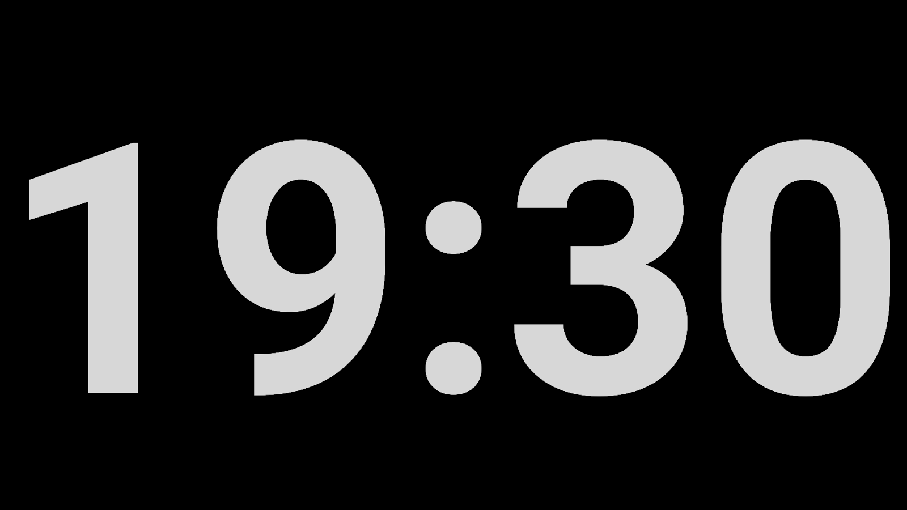
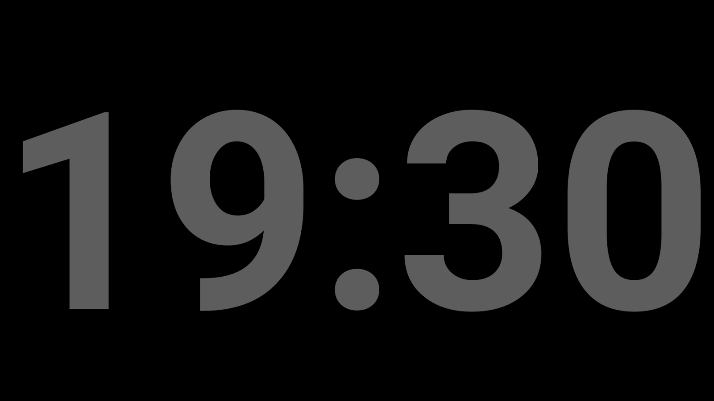
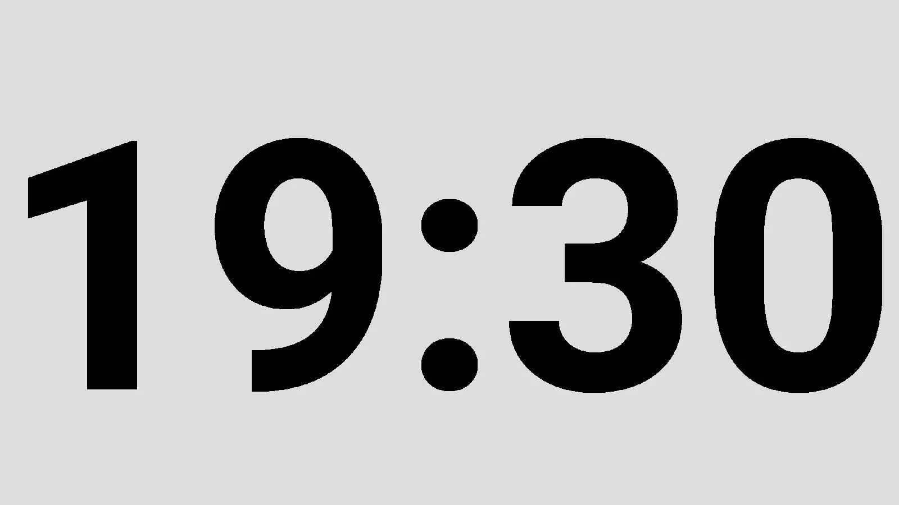

# Just 24 Hours

When all you need is to know what time it is, only the actual time matters.

There are many wonderful clock applications available for Android devices.
Many have have lots of great features. Choice in applications is a good
thing.

When one wishes to choose a simple clock application that just displays the
time of day in as large numbers as can fit on the screen's device, Just 24
Hours is here!

'''Features:'''

Just 24 Hours will display the time of day in 24 hour format in a big
numbers as will fit on the screen. For those that were corrective lenses,
it can be challenging to read small numbers when just waking up. Big
numbers are required. No matter what size screen your Android device has,
Just 24 Hours will use as big a text size that will fit on the screen.

That is all. No alarm settings. No typeface settings. No colour settings.

Just a big clock to see what time of day it is.

Of course, this is not what everyone wants in a clock application. This is
okay. There are dozens of clock applications available for Android. Most
(maybe all!) are great applications. We are certain that there will be one
that will satisfy one's desired features. For those that just want the
time, Just 24 Hours is here!  

  

  

  

  

## License

Paseo is distributed under the MIT [license](LICENSE)
